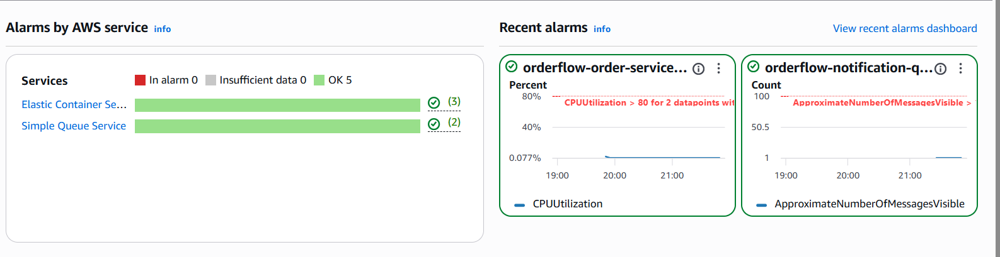
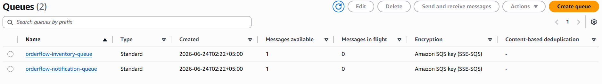
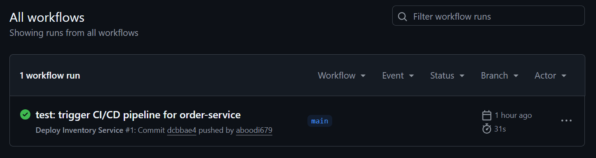

# OrderFlow — Event-Driven Microservices Platform on AWS

> Took an empty folder and turned it into a live AWS microservices platform. No templates. No shortcuts.

[](https://github.com/aboodi679/orderflow-aws/actions)
[](https://www.terraform.io/)
[](https://aws.amazon.com/)
[](https://aws.amazon.com/fargate/)

---

## What Is This?

OrderFlow is a production-grade, event-driven microservices platform deployed entirely on AWS. It was built from scratch to demonstrate real cloud engineering skills — not concepts, not tutorials, but live running infrastructure provisioned with zero manual console interaction.

Every resource in this project — VPC, subnets, ECS cluster, ALB, ECR, SQS queues, SNS topic, EventBridge rules, CloudWatch alarms, X-Ray tracing — was created and managed through modular Terraform IaC.

---

## Architecture


### Event Flow

```
Client Request
      │
      ▼
Application Load Balancer (port 80)
      │
      ▼
ECS Fargate Cluster
      │
      ├── order-service     (Flask · port 5000 · /orders/*)
      ├── inventory-service (Flask · port 5001 · /inventory/*)
      └── notification-service (Flask · port 5002 · /notify/*)
      │
      ▼
order.created event fired
      │
      ▼
Amazon EventBridge
      │
      ├──► SQS inventory-queue   (direct target)
      │
      └──► Amazon SNS orders-topic
                  │
                  └──► SQS notification-queue (fan-out)
```

---

## Tech Stack

| Layer | Technology |
|---|---|
| Compute | Amazon ECS Fargate |
| Networking | AWS VPC, ALB, public/private subnets, IGW |
| Containers | Docker, Amazon ECR |
| Messaging | Amazon EventBridge, SQS, SNS |
| CI/CD | GitHub Actions (OIDC — zero hardcoded keys) |
| Observability | CloudWatch Dashboard, Metric Alarms, AWS X-Ray |
| IaC | Terraform (modular) |
| Language | Python 3.11, Flask |

---

## Microservices

| Service | Port | Route | Responsibility |
|---|---|---|---|
| order-service | 5000 | /orders/* | Accepts orders, fires EventBridge events |
| inventory-service | 5001 | /inventory/* | Consumes SQS inventory queue |
| notification-service | 5002 | /notify/* | Consumes SQS notification queue via SNS |

### Health Check

```bash
curl http://orderflow-alb-1358729812.us-east-1.elb.amazonaws.com/health
# {"service":"order-service","status":"healthy"}
```

---

## Infrastructure

### Terraform Module Structure

```
terraform/
├── environments/
│   └── primary/               # us-east-1 deployment
│       ├── main.tf            # Module orchestration
│       ├── variables.tf
│       └── terraform.tfvars
└── modules/
    ├── networking/            # VPC, subnets, route tables, SGs, IGW
    ├── ecs/                   # Fargate cluster, task defs, services, ECR, ALB
    ├── messaging/             # SQS, SNS, EventBridge rules and targets
    └── observability/         # CloudWatch dashboard, alarms, X-Ray group
```

### Deploy from Scratch

```bash
git clone https://github.com/aboodi679/orderflow-aws.git
cd orderflow-aws/terraform/environments/primary
terraform init
terraform apply
```

> Requires: AWS CLI configured, Terraform >= 1.6.0

### Tear Down (cost saving)

```bash
terraform destroy
```

---

## CI/CD Pipeline

Each microservice has its own GitHub Actions workflow triggered on path-specific pushes.

```
Push to services/order-service/**
          │
          ▼
GitHub Actions (ubuntu-latest)
          │
          ├── Configure AWS via OIDC (no stored credentials)
          ├── Login to Amazon ECR
          ├── Docker build + tag (${{ github.sha }} + latest)
          ├── Push to ECR
          └── Force ECS rolling redeploy
```

**OIDC** means zero AWS access keys stored in GitHub Secrets — the pipeline assumes an IAM role directly via web identity token. Enterprise-grade security from day one.

---

## Observability

### CloudWatch Dashboard

Live metrics tracked:
- ECS CPU utilization (all 3 services)
- ECS Memory utilization (all 3 services)
- ALB request count
- ALB target response time
- SQS messages sent/received (inventory queue)
- SQS messages sent/received (notification queue)

### Alarms

| Alarm | Threshold | Action |
|---|---|---|
| ECS CPU high (×3 services) | > 80% for 2 periods | Alert |
| SQS inventory queue depth | > 100 messages | Alert |
| SQS notification queue depth | > 100 messages | Alert |

### X-Ray

Distributed tracing configured with custom sampling rule (5% fixed rate) and service group filter for the orderflow namespace.

---

## Screenshots

### ECS Services — All Running


### CloudWatch Alarms — All OK


### EventBridge Rule — Enabled


### SQS Queues — Live with Messages


### GitHub Actions CI/CD — Green


---

## Event-Driven Test

Manually fire an `order.created` event to verify the full messaging pipeline:

```bash
aws events put-events --entries file://test-event.json --region us-east-1
```

```json
[
  {
    "Source": "orderflow.order-service",
    "DetailType": "order.created",
    "Detail": "{\"order_id\":\"ORD-001\",\"item\":\"laptop\",\"qty\":1}",
    "EventBusName": "default"
  }
]
```

Verify message arrived in SQS:

```bash
aws sqs receive-message \
  --queue-url https://sqs.us-east-1.amazonaws.com/026243800492/orderflow-inventory-queue \
  --region us-east-1
```

---

## Cost

Estimated monthly cost with all resources running: **~$22–25/month**

| Service | Est. Cost |
|---|---|
| ECS Fargate (3 services, minimal config) | ~$8–10 |
| ALB | ~$8 |
| DynamoDB / SQS / SNS / EventBridge | ~$1–2 |
| CloudWatch + X-Ray | ~$2–3 |
| ECR + S3 | ~$1 |

> Tip: Run `terraform destroy` when not actively using to eliminate compute costs.

---

## Author

**Muhammad Abdullah**
Fresh Software Engineering graduate | Cloud & DevOps Engineer

[](https://linkedin.com/in/muhammadabdullah-b887272a5)
[](https://github.com/aboodi679)

---

## Related Projects

- [AI Hitman — Cloud Game Backend](https://github.com/aboodi679/ai-hitman-backend) — Flask REST API on AWS Lambda, DynamoDB, S3, API Gateway, Terraform
- [AWS 3-Tier Web Architecture](https://lnkd.in/dJMAFYWy) — ALB, EC2, RDS MySQL, modular Terraform, multi-AZ
